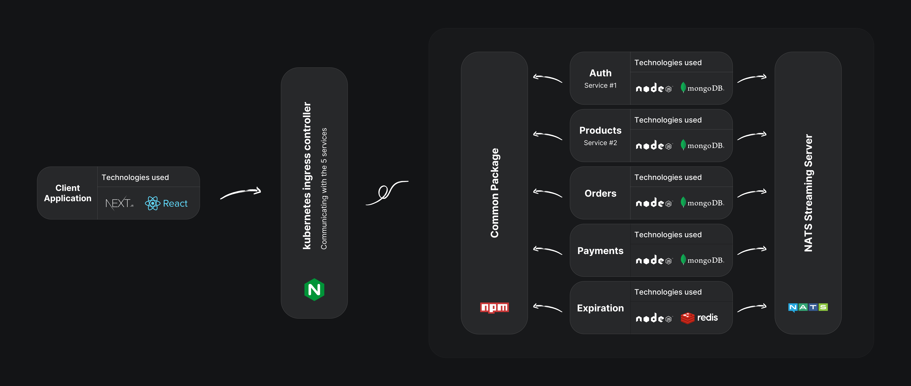

The aim of this project is to build an e-commerce microservices architecutre ticket for exchanging and resaling tickets/ Products 💈

---

<br>


## 🏛 **Architecture**
Application Architecture/ Components.

1. The architecutre uses NATS streaming server as a messaging system between the services each service has its complete independece incl.(Database).
2. it consists of 5 services, each service uses Node.js and Mongodb, except **The Expiration** service which uses Redis as a chaching layer and event publisher and reciever
3. **@ticketit/common package**: that shares refactored dynamic resuable errors, events, middlewares, to all the microservices.
4. **NGINX Ingress controller**: that is runing in a k8s cluster and configures the HTTP load balancer for the all the different services
5. **Client application**: that is written with Next.js and React which interacts with all the listed services through k8s Ingress controller





---

<br>

## 💎 **Repository structure**
- The architecutre consists of five **microservices**.
- The source code of each **microservice** resides in its own sub-directory, which is named after the microservice.
- **React Client application** that interacts with all of these services. 
- Reusable package that deals with common re-usable tools e.g(error handling, middlewares, etc..)


Overview of the application services

| Service | Type | Description | Build
----------|-----|------------| ----|
[**Auth**](auth/README.md)  | Microservice |    Authentication functionalities| Passing ☘️
[**Tickets**](tickets/README.md)   | Microservice |  Tickets functionalities| Passing ☘️
[**Orders**](orders/README.md)    | Microservice |  Order functionalities| Passing ☘️
[**Expiration**](expiration/README.md) | Microservice |  Orders cancellation system| Passing ☘️
[**Payments**](payments/README.md)   | Microservice |  Payments functionalities| Passing ☘️
[**Common**](common/README.md)   | [Package](https://www.npmjs.com/package/@ticketit/common) |  Reusable package that deals with common re-usable tools e.g(error handling objects, interfaces and types, middlewares, etc..)| Passing ☘️
[**Client**](client/README.md)  | Application |  **React Client application** that interacts with all of these services. | Passing ☘️

---

<br>

## 🧪 **Setup**

1. ###  **Tools Setup**
   One of the main prerequisists to run this architecture is having Docker, Kubernetes/ Kubectl, Skaffold, Node.js, ingress-nginx controller installed.
   1. [**Node.js installation**](https://nodejs.org/en/)  | My setup (v12.21.0)
   2. [**Docker installation**](https://docs.docker.com/docker-for-mac/release-notes/) | My setup (v20.10.5)
   3. [**Kubectl installation**](https://kubernetes.io/docs/tasks/tools/) | My setup (v1.19.7)
   4. [**Skaffold installation**](https://skaffold.dev/docs/install/) | My setup (v1.22.0)
   4. [**NGINX Ingress installation**](https://kubernetes.github.io/ingress-nginx/deploy/#docker-desktop) | My setup (v0.46.0)

   ---

<br>


2. ### **Service object**
   Create a Service object that exposes the deployment.

   ```lua
   kubectl expose deployment ingress-nginx --target-port=80 --type=NodePort -n kube-system
   ```
   ---   


<br>

2. ### **Setting up environment secrets**
   This cluster has two environment secrets that must be setup before running it ```jwt-secret``` and ```stripe-secret```, so activate your Kubernetes in your Docker environment if you didn't, and let's setup those secrets 🔒

   ---

   **```jwt-secret```** is for the authentication service.

   ```lua
   kubectl create secret generic jwt-secret --from-literal=JWT_KEY=ANYTHING
   ```

   **```stripe-secret```** is for the payment service

   ```lua
   create secret generic stripe-secret --from-literal STRIPE_KEY=YOUR_SECRET_KEY_GOES_HERE
   ```
## 🚀 **Run**

You cna create/ run the cluster locally or on mutliple providers, but to run it locally after the setup use can do so using skaffold, which will cause all the images to build:

```
skaffold dev
```
---

<div align="center">

**And that was it, Thanks for reading 🎉**

</div>